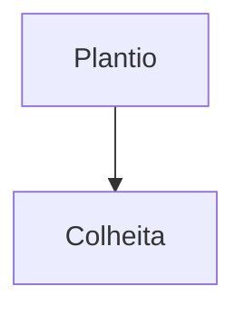

# Diário da Cooperativa Aurora

A cooperativa fictícia Aurora planta café no vale do rio Claro.
Veja [[Reading Time/curta|a nota curta]] e o [site](https://example.com/aurora).

![[imagem-inexistente.png]]

%% este comentário não conta %%
<!-- nem este -->

> [!tip]- Dica da semana
> Regue as mudas cedo.

- [ ] Comprar adubo orgânico
- [x] Consertar a cerca

```js
const safra = colher('café', 2026);
```



$$
area = largura \times altura
$$

Fim do diário ^fim
